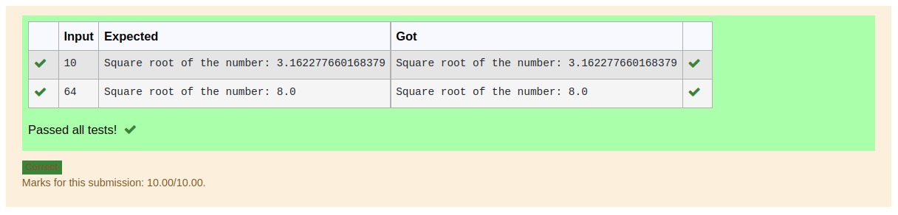

# Find the square root of a number

## AIM:
To write a program to find the square root of a number.

## Equipments Required:
1. Hardware – PCs
2. Anaconda – Python 3.7 Installation / Moodle-Code Runner

## Algorithm
1. Get the value from the user.
2. Set number = 1.
3. Assign number_iters = 10 in the for() loop to perform 10 iteratios.
4. Calculate  number = 0.5 * (number + a / number) for 10 iterations.
5. Print the number

## Program:
```python
'''
Program to find the square root for the given number(newton's method) using function.
Developed by: R LAKSHANA
RegisterNumber: 22004909
'''
num=int(input())
x=1
for i in range(10):
    x=0.5*(x+num/x)
print("Square root of the number:",x)
```

## Output:


## Result:
Thus the program to find the square root for the given number(newton's method) using function is written and verified using python programming.
